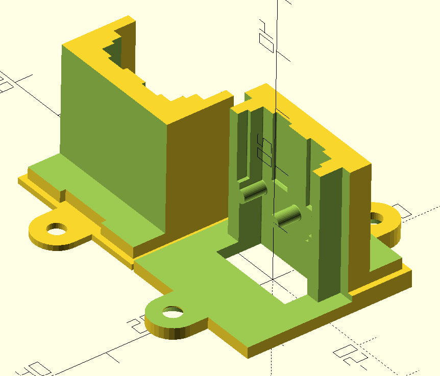

# HCalory PowerPole Connector replacement
3D printable part to replace the panelmount DC connector with Anderson PowerPole plugs for the Hcalory EC30 portable/car fridge, as the connector on mine had melted (see picture below).

The original connector seems to be a misuse of the AC IEC connector C11/C12, which a lot of portable fridge manufacturers use on their devices. This replacement fits the original hole in the panel and replaces the C12 connector with an Anderson PowerPole PP15/30/45.

Also, **the original connector has an integrated fuseholder, so a fuse has to be added between the PowerPole connector and the internal connections** to avoid risk of fire and other damage to the device!

## Pictures
### Model
The model is designed as one whole unit, which is then split into two printable parts that fit together.

### Sliced Model
This was sliced with PrusaSlicer with the supports for the outer PowerPole peg holes removed (as it isn't needed) so only the center support stays.

### Print

### 

### Original (melty) connector
Here, the plastic around the positive pin of the socket has melted, likely due to bad contact resistance. The pin on the plug side has melted as well.

